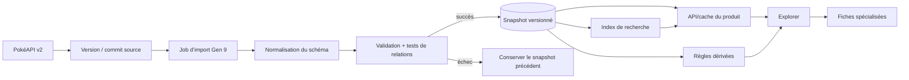
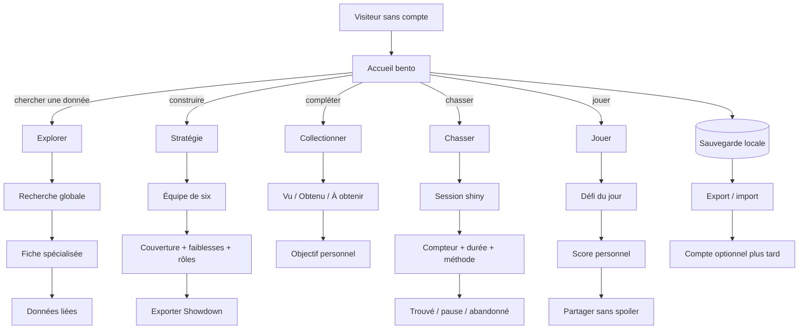
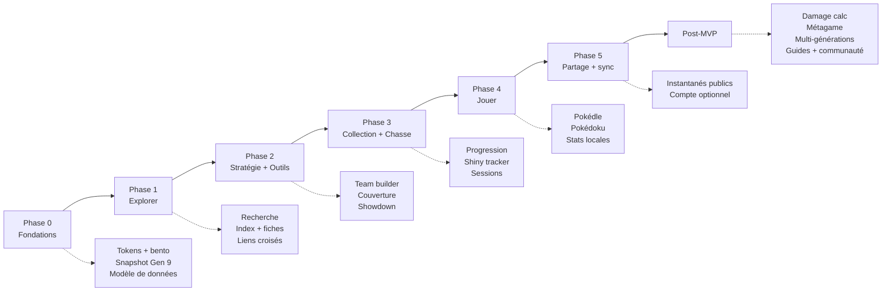

# Diagrammes produit

Ces diagrammes décrivent l’architecture cible du MVP. Ils utilisent Mermaid et peuvent être rendus dans GitHub, VS Code ou la plupart des lecteurs Markdown compatibles.

## 1. Sitemap

```mermaid
flowchart TD
    HOME[Accueil bento]
    HOME --> EX[Explorer]
    HOME --> ST[Stratégie]
    HOME --> OUT[Outils]
    HOME --> COL[Collectionner]
    HOME --> HUNT[Chasser]
    HOME --> PLAY[Jouer]

    EX --> SEARCH[Recherche globale]
    EX --> P[Pokémon]
    EX --> MOVES[Attaques]
    EX --> AB[Talents]
    EX --> ITEMS[Objets]
    EX --> TYPES[Types]
    EX --> EVO[Évolutions]
    EX --> STATS[Statistiques]
    P --> PF[Fiche Pokémon]
    MOVES --> MF[Fiche attaque]
    AB --> AF[Fiche talent]
    ITEMS --> IF[Fiche objet]

    ST --> TEAMS[Mes équipes]
    ST --> BUILDER[Créer une équipe]
    ST --> TEAM[Équipe / analyse]
    ST --> SHOWDOWN[Import / export Showdown]

    OUT --> COVER[Couverture d’équipe]
    OUT --> WEAK[Faiblesses / résistances]
    OUT --> ROLES[Résumé des rôles]

    COL --> DEX[Pokédex Gen 9]
    COL --> FORMS[Formes]
    COL --> SHINY[Shiny]
    COL --> GOALS[Objectifs personnels]

    HUNT --> NEW_HUNT[Nouvelle chasse]
    HUNT --> ACTIVE[Chasses en cours]
    HUNT --> HISTORY[Historique]

    PLAY --> DAILY[Défi quotidien]
    DAILY --> POKEDLE[Pokédle-like]
    DAILY --> POKEDOKU[Pokédoku-like]
    PLAY --> UNLIMITED[Mode illimité]
    PLAY --> PERSONAL[Statistiques personnelles]
```

## 2. Flux des données PokéAPI vers Explorer

Règle : le navigateur ne dépend pas directement de PokéAPI en production. Les données importées, les règles calculées et les assets sont conservés comme trois responsabilités distinctes.

## 3. Parcours utilisateur principaux

## 4. Roadmap MVP / post-MVP

## Lecture recommandée

L’ordre de construction suit le flux de confiance : d’abord rendre les données fiables et trouvables, puis aider à les utiliser, ensuite enregistrer la progression, et enfin ajouter les boucles de jeu et de partage.
